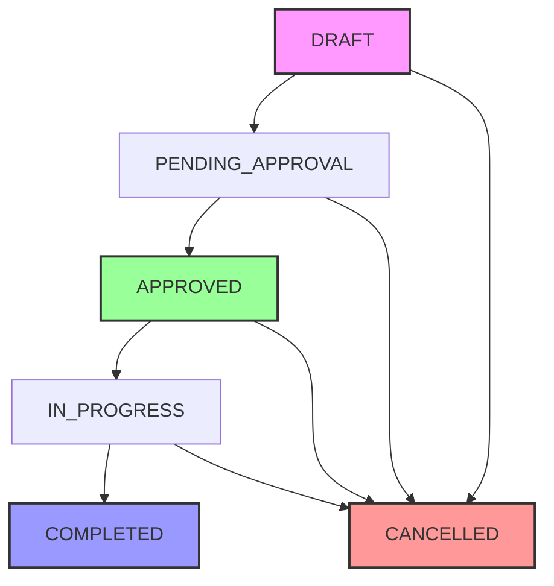

# Work Orders API

The Work Orders API provides comprehensive endpoints for managing construction work orders, including creation, updates, approvals, and status tracking. All endpoints require authentication and follow RESTful conventions.

## Authentication

All API requests require a valid Bearer token in the Authorization header:

```bash
Authorization: Bearer <your_api_token>
```

## Rate Limits

- **Standard requests**: 1000 requests per hour per API key
- **Bulk operations**: 100 requests per hour per API key
- **Preview operations**: 500 requests per hour per API key

Rate limit headers are included in all responses:
- `X-RateLimit-Limit`: Request limit per hour
- `X-RateLimit-Remaining`: Remaining requests in current window
- `X-RateLimit-Reset`: UTC timestamp when the rate limit resets

## Base URL

```
https://api.ttipl.com/v1
```

## Available Endpoints

The Work Orders API provides the following endpoints for complete work order lifecycle management:

- **[Create Work Order](/api/endpoints/create-work-order)** - `POST /work-orders` - Create new work orders with support for different types
- **[Get Work Order](/api/endpoints/get-work-order)** - `GET /work-orders/{id}` - Retrieve detailed information about a specific work order  
- **[List Work Orders](/api/endpoints/list-work-orders)** - `GET /work-orders` - Get paginated list of work orders with filtering
- **[Update Work Order](/api/endpoints/update-work-order)** - `PUT /work-orders/{id}` - Update existing work orders in DRAFT status
- **[Delete Work Order](/api/endpoints/delete-work-order)** - `DELETE /work-orders/{id}` - Remove work orders that are in DRAFT status
- **[Approve Work Order](/api/endpoints/approve-work-order)** - `POST /work-orders/{id}/approve` - Approve work orders for execution

## Work Order Types

The API supports different types of work orders to accommodate various construction scenarios:

<Tabs>
  <Tab title="DIRECT_BOQ">
    **Direct BOQ Linked Work Orders**
    
    - Directly linked to BOQ (Bill of Quantities) items
    - Rates are predefined in the BOQ system
    - Automatic cost calculation based on BOQ rates
    - Ideal for standard construction activities
    
    ```json
    {
      "type": "DIRECT_BOQ",
      "items": [
        {
          "boqId": "boq_foundation_001",
          "quantity": 100,
          "rate": 2500.00
        }
      ]
    }
    ```
  </Tab>
  
  <Tab title="INDIRECT_BOQ">
    **Indirect BOQ Linked Work Orders**
    
    - Related to BOQ but allows custom rates
    - Useful when standard BOQ rates don't apply
    - Maintains BOQ linkage for tracking purposes
    - Flexible pricing for special circumstances
    
    ```json
    {
      "type": "INDIRECT_BOQ", 
      "items": [
        {
          "boqId": "boq_foundation_001",
          "quantity": 100,
          "rate": 2750.00
        }
      ]
    }
    ```
  </Tab>
  
  <Tab title="NON_BOQ">
    **Non-BOQ Work Orders**
    
    - Independent work not linked to any BOQ
    - Custom items and pricing
    - Suitable for ad-hoc or specialized work
    - Complete flexibility in work definition
    
    ```json
    {
      "type": "NON_BOQ",
      "items": [
        {
          "description": "Emergency repair work",
          "quantity": 1,
          "rate": 5000.00
        }
      ]
    }
    ```
  </Tab>
  
  <Tab title="LABOUR">
    **Labour-Only Work Orders**
    
    - Labour-only work orders without materials
    - Focused on human resource allocation
    - Separate tracking of labor costs
    - Ideal for service-based activities
    
    ```json
    {
      "type": "LABOUR",
      "items": [
        {
          "description": "Site supervision",
          "quantity": 8,
          "rate": 500.00
        }
      ]
    }
    ```
  </Tab>
</Tabs>

## Work Order Status Flow

Work orders follow a defined status progression to ensure proper approval and tracking:



| Status | Description | Available Actions |
|--------|-------------|-------------------|
| `DRAFT` | Newly created, can be edited | Update, Delete, Submit for Approval |
| `PENDING_APPROVAL` | Submitted for approval | Approve, Reject, Cancel |
| `APPROVED` | Approved and ready for execution | Start Work, Cancel |
| `IN_PROGRESS` | Work is ongoing | Mark as Complete, Cancel |
| `COMPLETED` | Work finished successfully | Archive |
| `CANCELLED` | Work order cancelled | Archive |

## Quick Start Example

Here's a complete example of creating and managing a work order:

<Steps>
  <Step title="Create a Work Order">
    ```bash
    curl -X POST "https://api.ttipl.com/v1/work-orders" \
      -H "Authorization: Bearer your_token" \
      -H "Content-Type: application/json" \
      -d '{
        "projectId": "proj_abc123",
        "type": "DIRECT_BOQ",
        "contractorId": "cont_def456",
        "items": [{
          "boqId": "boq_xyz789",
          "quantity": 100,
          "rate": 2500.00
        }],
        "startDate": "2024-01-15",
        "endDate": "2024-03-30"
      }'
    ```
  </Step>
  
  <Step title="Check Work Order Status">
    ```bash
    curl -X GET "https://api.ttipl.com/v1/work-orders/wo_abc123" \
      -H "Authorization: Bearer your_token"
    ```
  </Step>
  
  <Step title="Approve the Work Order">
    ```bash
    curl -X POST "https://api.ttipl.com/v1/work-orders/wo_abc123/approve" \
      -H "Authorization: Bearer your_token" \
      -H "Content-Type: application/json" \
      -d '{
        "approvedBy": "user_manager",
        "comments": "Approved for execution"
      }'
    ```
  </Step>
</Steps>

## Need Help?

- **Getting Started**: Check out our [Work Order Overview](/work-order/overview)
- **Data Structure**: Review our [Schema Documentation](/work-order/schema) 
- **Integration**: See our [Integration Guide](/work-order/integrations)
- **Business Rules**: Understand our [Business Logic](/work-order/business-logic)

Ready to start? Click on any endpoint in the sidebar to see detailed documentation with examples!